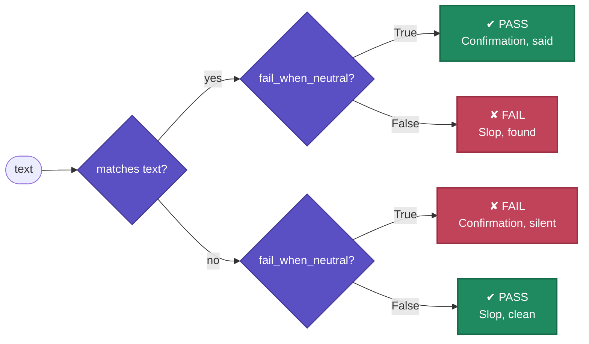

<p align="center">
  
</p>

# Lexguard

## The problem

You're evaluating an AI agent. You want to know whether its reply is polite, or whether it
overclaimed, leaked something it shouldn't have, or buried the answer under sycophantic preamble.
The obvious move is to grep the output for a few words, and one list of words breaks fast: an agent
that writes "could you please fix the fucking bug" used the word "please" and swore in the same
breath. A single word list can't tell those two apart, so it either misses the problem or, worse,
scores a bad reply as fine.

Lexguard is still just word matching, it's not doing anything clever with the text. The difference
is a second list: words that rule the concept back out. Point it at a reply and get back one of
three answers: the concept is there, it's absent, or the wording rules it out.

```py
from lexguard import Politeness

print(Politeness.signal("could you send this over when you get a sec?"))
#> present
print(Politeness.signal("send me the report"))
#> absent
print(Politeness.signal("could you please fix the fucking bug"))
#> denied
```

`denied` is not the same as `absent`. A reply with no politeness words at all is merely unasked for.
This one has a politeness word, but the swearing cancels it out, so it's rated denied, not present.

## How it works

That three-way check is a `Lexicon`: a named set of words and phrases that signal a concept
(`indicates`), the words that rule it out (`rules_out`), and a plain sentence saying what to do
about a hit (`fix`). It's matched by plain substring, no model in the loop, so a check is instant
and gives the same verdict every time. A set of them ship in the box already, tuned for agent
transcripts: what a user asked for and what a model produced, from slop and sycophancy to leaked
secrets and overclaimed confidence, alongside politeness; run `lexguard` to list every one.
Extending a lexicon means editing its list; `lexguard <name>` prints one as source to paste into
your own module and change. See [Writing a lexicon](docs/writing-a-lexicon.md).

`.signal()`, `.matches()` and `.denied()` are plain functions over text: call them directly on
whatever an agent returned, in a guardrail before a reply goes out, an `assert` in a unit test, or a
filter in a log pipeline.

## What a match means

Most lexicons are checked for absence — `Slop`, `Confidential`, `Rudeness` are things you don't
want, so a match is the failure. A few, like `Confirmation` and `Politeness`, are checked for
presence instead: they set `fail_when_neutral=True`, so silence is the failure. Same two decisions
every time; only the second answer changes.



See [Writing a lexicon](docs/writing-a-lexicon.md#fail_when_neutral-what-a-match-means) for the
full explanation.

## Install

```bash
uv add lexguard
```

The core has no dependencies. A `Lexicon` does everything itself — `lexicon.verdict(text)` is the
framework-agnostic check every [integration](docs/integrations/index.md) wraps in a couple of
lines, whether that's an eval framework or a guardrail; each is its own extra:

```bash
uv add "lexguard[pydantic-evals]"
uv add "lexguard[deepeval]"
uv add "lexguard[inspect-ai]"
uv add "lexguard[pydantic-ai-harness]"
```

If you want to use it as a dev tool and not worry about which repo you are in then install it as a tool:

```bash
uv tool install lexguard
```

## Using it without an evals framework

`signal()`, `matches()` and `denied()` are the whole API surface at this layer: plain calls over a
string. Nothing here needs `Dataset`, `Case`, or pydantic-evals in general, so a lexicon works just
as well as a guardrail before a response goes out, a plain `assert` in a unit test, or a filter in
a log pipeline.

```py
from lexguard import Confidential


def guard(reply: str) -> str:
    if Confidential.matches(reply):
        raise ValueError("reply leaks a secret, blocking send")
    return reply
```

## Running it inside pydantic-evals

`LexguardEvaluator`, from `lexguard.integrations.evals.pydantic_evals`, wraps a lexicon as an
evaluator, for when you want the same check running as part of a `Dataset` alongside everything else.

```py
from pydantic_evals import Case, Dataset

from lexguard import Apology, Postamble, Preamble, Slop, Sycophancy
from lexguard.integrations.evals.pydantic_evals import LexguardEvaluator


async def agent(prompt: str) -> str:
    return "Great question! Let us delve in. Hope this helps!"


dataset = Dataset(
    name="prose",
    cases=[Case(name="explainer", inputs="explain database indexing")],
    evaluators=[
        LexguardEvaluator(Slop),
        LexguardEvaluator(Preamble),
        LexguardEvaluator(Postamble),
        LexguardEvaluator(Sycophancy),
        LexguardEvaluator(Apology),
    ],
)
report = dataset.evaluate_sync(agent)
print(sorted(name for name, result in report.cases[0].assertions.items() if not result.value))
#> ['Postamble', 'Slop', 'Sycophancy']
```

Each rule checks exactly one lexicon and reports under its own name — nothing merges multiple
lexicons into a single pass/fail, so a failure always points at exactly what fired.

## Running it as a guardrail

`lexguard_guard`, from `lexguard.integrations.guardrails.pydantic_ai`, wraps a lexicon (or a
`Bundle` of them) as a [pydantic-ai-harness](https://pydantic.dev/docs/ai/harness/guardrails/)
`InputGuardrail`/`OutputGuardrail`/`ToolGuardrail` guard, blocking a reply before it goes out.

```py
from pydantic_ai import Agent
from pydantic_ai.models.test import TestModel
from pydantic_ai_harness.guardrails import OutputBlocked, OutputGuardrail

from lexguard import Slop
from lexguard.integrations.guardrails.pydantic_ai import lexguard_guard

agent = Agent(
    TestModel(custom_output_text="Let us delve into the intricate tapestry of caching."),
    capabilities=[OutputGuardrail(guard=lexguard_guard(Slop))],
)
try:
    agent.run_sync("explain caching")
except OutputBlocked as blocked:
    print(blocked)
    """
    3 slop matches: "delve", "intricate", "tapestry"
      delve -> Let us delve into the intricate tapestry of ca…
      intricate -> Let us delve into the intricate tapestry of caching.
    fix: swap for a plain verb or noun, or add these to the sampler ban list
    """
```

A guard can only return one `allow`/`block`, so this is the one place a `Bundle` genuinely
combines several lexicons into a single decision — a block still lists every one that fired.

## Failures tell you what to change

```py
from pydantic_evals import Case, Dataset

from lexguard import Slop
from lexguard.integrations.evals.pydantic_evals import LexguardEvaluator


async def agent(prompt: str) -> str:
    return "Let us delve into the intricate tapestry of indexing."


report = Dataset(
    name="prose", cases=[Case(inputs="explain indexing")], evaluators=[LexguardEvaluator(Slop)]
).evaluate_sync(agent)
print(report.cases[0].assertions["Slop"].reason)
"""
3 slop matches: "delve", "intricate", "tapestry"
  delve -> Let us delve into the intricate tapestry of in…
  intricate -> Let us delve into the intricate tapestry of indexing.
fix: swap for a plain verb or noun, or add these to the sampler ban list
"""
```

## Closing the loop

`fix` is not just for a test report. It works standing alone, so a guardrail in the agent loop
does not just block a bad reply, it can hand the agent something to retry with. Tag it with the
name and the message says what fired, handed back on its own.

```py
from lexguard import Slop


def guard(reply: str) -> str | None:
    return f"{Slop.name}: {Slop.fix}" if Slop.matches(reply) else None


print(guard("let us delve into the intricate tapestry"))
#> slop: swap for a plain verb or noun, or add these to the sampler ban list
print(guard("caching skips repeated work"))
#> None
```

A non-`None` result is the next prompt: feed it back in and let the agent take another turn,
instead of failing the whole run.

## From the command line

`lexguard` lists the built-in lexicons, one per line; `lexguard <name>` prints one as `Lexicon(...)`
source to paste into your code.

```bash
lexguard
```

You can pipe it to fzf (or another tool if installed) to get a fuzzy picker.

```console
lexguard | fzf --preview 'lexguard {}'
```

Or you can drop a shell function in your `~/.zshrc` so `lg` opens a fuzzy picker
with a formatted, syntax-highlighted preview (via [ruff](https://github.com/astral-sh/ruff) and
[bat](https://github.com/sharkdp/bat)):

```zsh
lg() {
  lexguard | fzf --ansi --preview 'lexguard {} | ruff format - | bat -l python --color=always --style=plain'
}
```

## Docs

- [Lexicons](docs/lexicons/index.md): every lexicon that ships in the box, generated from
  source, one page per group
- [Writing a lexicon](docs/writing-a-lexicon.md) for your own domain
- [Agents](docs/agents.md) under test with pydantic-ai
- [Integrations](docs/integrations/index.md): evals (pydantic-evals, DeepEval, Inspect AI) and
  guardrails (pydantic-ai-harness), each with its own page

## Prior art

The slop word lists overlap heavily with
[slop-forensics](https://github.com/sam-paech/slop-forensics), which derives them statistically
rather than by hand. Fold that list into a `Slop` copy in your own module if you want the empirical
version. The abstain semantics, where a lexicon that does not apply records nothing rather than a
free pass, is the same idea as a Snorkel labelling function returning `None`.
